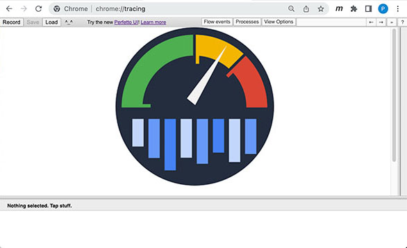
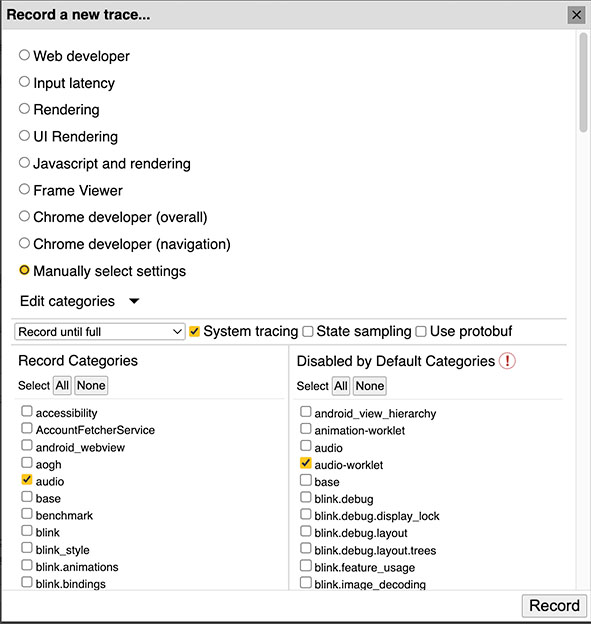
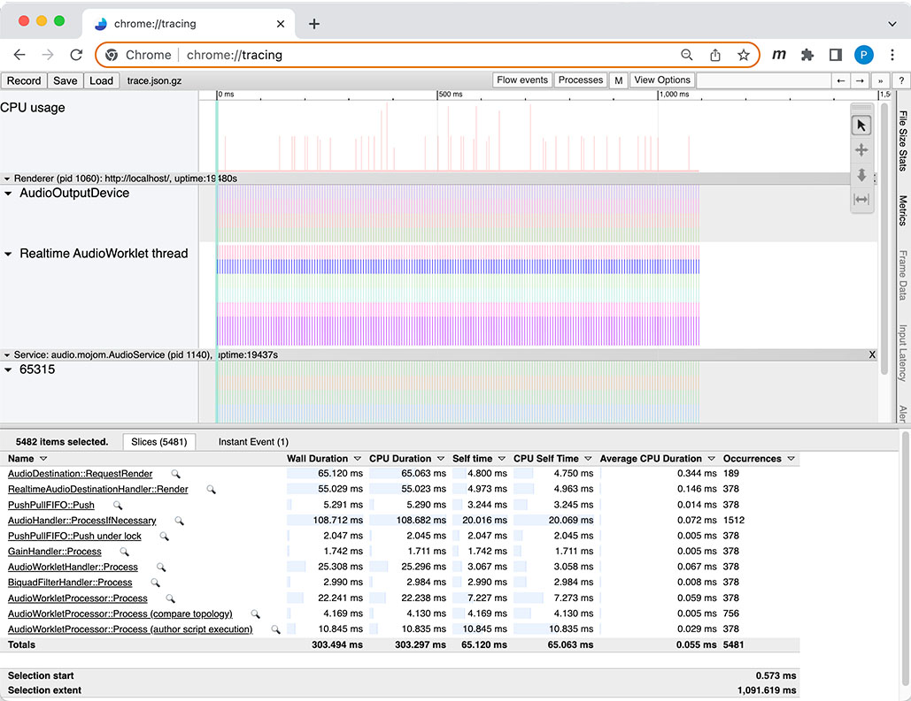
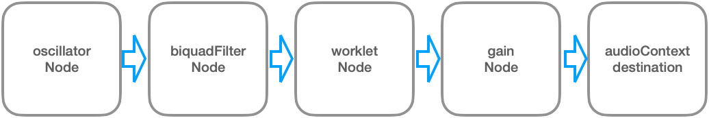
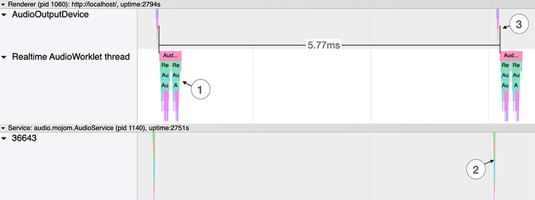
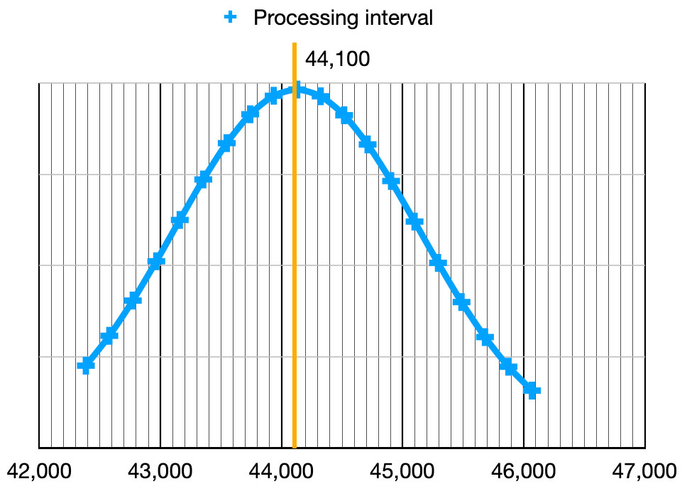
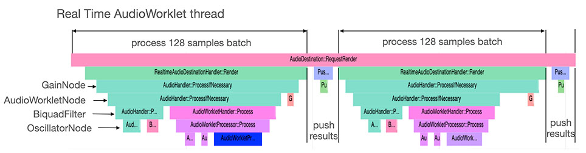
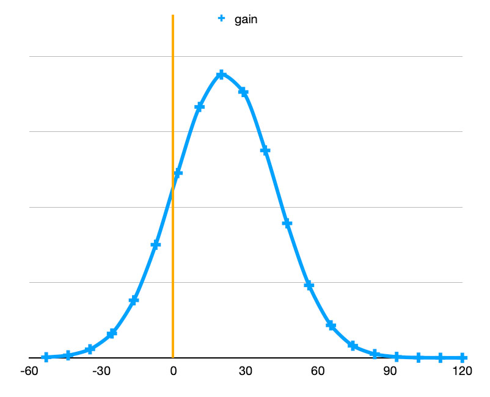
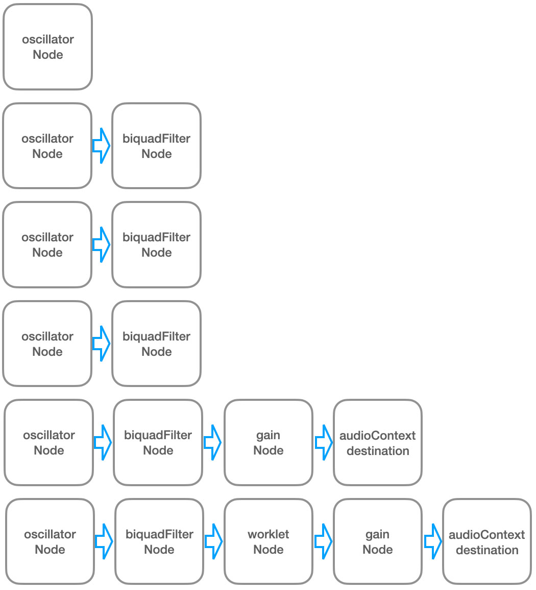
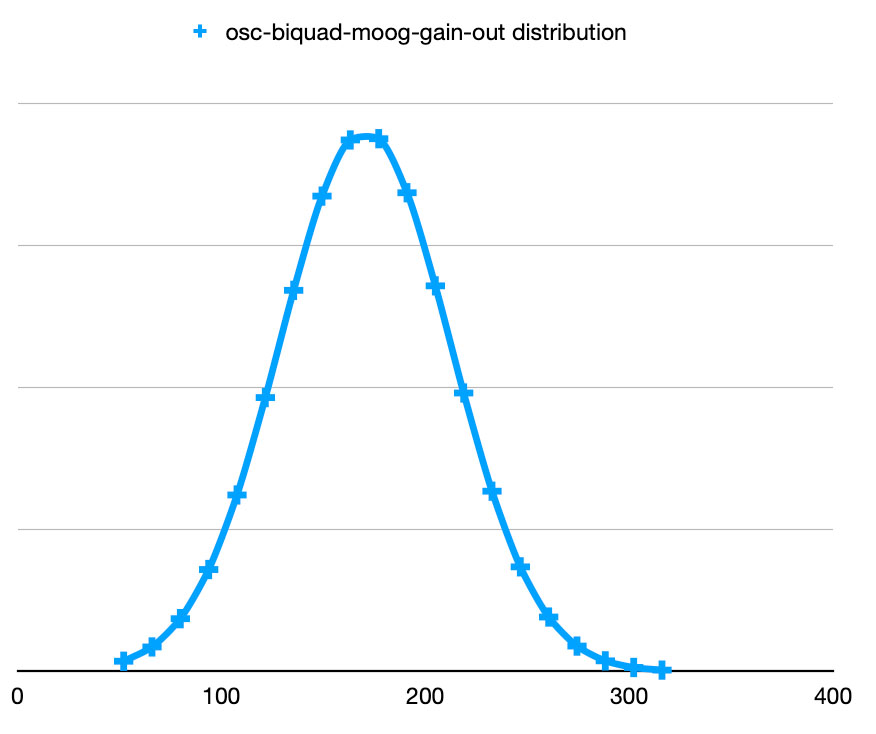

# webaudio-chrome-tracing
Measurements on WebAudio with google chrome tracing

Being interested in the web Audio audioWorklet, I wished to use the <em>about:tracing</em> analysis tool offered by Google Chrome to quantify the execution times of the different WebAudio nodes. These measurements show some results that surprised me. I am far from being an expert and the results that I give engage only me and are given without any guarantee.
# Using Chrome <i>about:tracing</i>

Chrome tracing is an exceptionally rich tool, but poorly documented.

In short:
* Start the WebAudio node chain you wants to test.
* Start Chrome tracing tool by opening <em>about:tracing</em> in a new tab
* Click the record button (top-left)
* Select the options you wants to trace. The following works for me.

    * #### Manually select settings

    * #### Record Categories
        * audio
        * webaudio

    * #### Disabled by Default categories
        * audio-worklet
        * webaudio.audionode

* Click the <em>Record</em> button to start recording.
* Click the stop button of the <em>Recording</em> pannel.

> the snapshot below will be displayed

# Webaudio Graph
I used the following case of study :

Hereafter are some of the results I've got.

# Variation #1 : Quantum process interval

1. process samples
2. "Pulls on our provider to get rendered audio stream." [Chromium code search]
3. "Takes care of invoking the render callback on the audio thread." [Chromium code search]

The interval between the two process sequences in the screenshot above is 5.77ms. We will see later that two quanta of 128 samples are processed consecutively (see two peaks in the Realtime Audioworklet thread section of the diagram (1)). It means 256 samples are processed in 5.77µs. A corresponding sample rate for this example is (1/0.00577)*256 = <b>44&nbsp;367</b>, close to but not equal to <b>44&nbsp;100</b> for this tracing take (~ 1.5 seconds). I guess there will be some FIFO treatment adjusting synchronization to 44 100 before audio output (3).

|   min   |   mean  |   max   |
|---------|---------|---------|
|  42 384 |  44 125 |  46 048 |

# Variation #2 : 512 samples Quantum

1. Chrome processed two batches of 128 samples in sequence every ~5.8ms.
2. The node processes are stacked (nested), not serialized.
3. The nodes start in reverse order with respect to the WebAudio graph.
4. After each processing samples are pushed in a <em>fifo</em> for further extraction.

The processing of a global batch of 256 samples increases the latency time. It seems, on the other hand, that the duration of the second quantum is shorter than the first, which can be an advantage from the CPU point of view.
 
The distribution diagram represents the difference (ms) between the first and the second WebAudio graph processing duration. Positive numbers represent how the duration of the second batch of 128 samples is shorter than the first one (µs).
    

# Variation #3 : AudioNode Process duration

### Table 1 to 3 :
* Column <em>measure</em> gives for each audio graph chain the overall process duration.
* Columns <em>osc, gain, biquad, moog</em> are deduced by subtraction of the oscillator process duration.
* Column <em>computed sun </em> sum represents a theoretical duration by adding each node duration of the chain.

##### Comments :
* The computed duration of the chain, excluding the workletNode, can be considered equal to the measured value.
No overhead because of the node-to-node interface.
* the oscillator Node seems to be CPU intensive compared to biquad for instance.
* Biquad filter seems to be highly optimized
* The ladder filter worklet is CPU consuming as expected.

### Table 4 :

#### Comments :
* The deviation from the mean value is fairly constant, regardless of the node type. GainNode is fairly special because of its intrinsic short duration
* To avoid glitches, we should consider the max duration, which can be much longer than the average value: in this case of study, we should use the max value: 574µs, while the average value is only 337µs.

